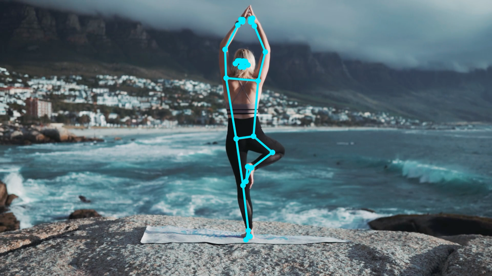
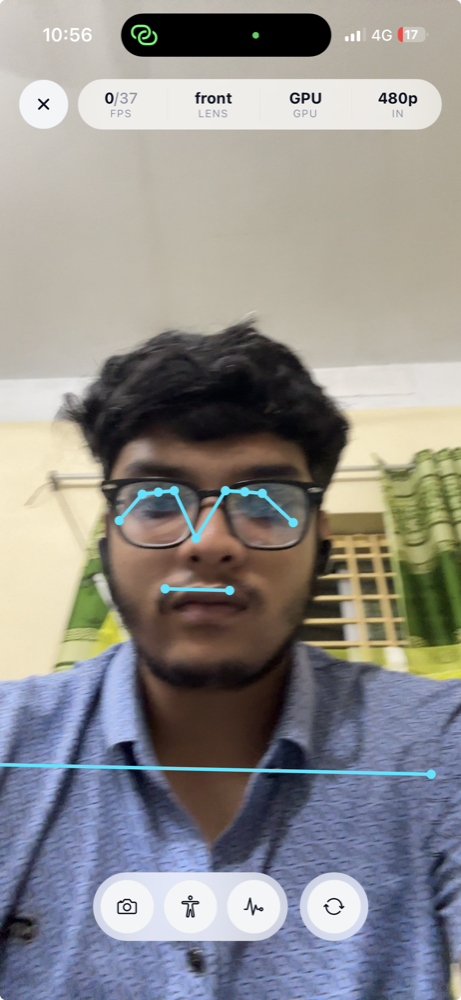
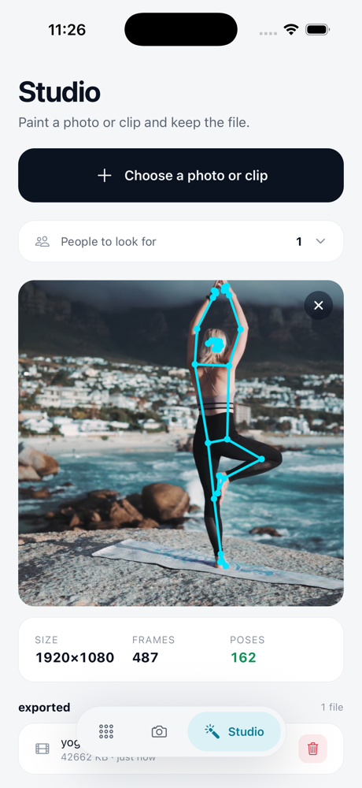
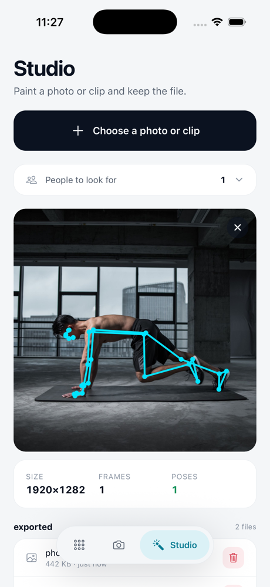

<div align="center">

# react-native-pose-detection

**Real-time human pose detection for React Native and Expo.**

33 body landmarks per frame, detected and drawn entirely in the native layer, powered by
MediaPipe. Works in Expo and bare React Native projects alike. Nothing crosses the bridge
until you ask.

[](https://github.com/khalid999devs/react-native-pose-detection/actions/workflows/ci.yml)
[](https://www.npmjs.com/package/react-native-pose-detection)
[](./LICENSE)


[Installation](#installation) · [Quick start](#quick-start) · [Do more](#do-more) · [Docs](#documentation)



  

</div>

## Why this one

- **One component.** `<PoseCamera />` opens the camera, finds the body, draws the skeleton.
  Every default overridable, none required.
- **Both install paths, first class.** The Expo config plugin and a CLI for bare React Native
  do the same job; both are built and tested in CI on every commit.
- **Zero bridge traffic by default.** Detection, smoothing, drawing and trigger logic run
  natively. Landmarks cross to JavaScript only when you opt in, as one zero-copy buffer.
- **Tunes itself to the phone.** Measures inference cost, converges on the fastest sustainable
  frame rate, backs off with heat, remembers the answer for the next launch.
- **Native triggers.** Declare "knee bent past 90 degrees for 300 ms", get one event when it
  happens. Thirty reps is thirty bridge crossings, not nine hundred.
- **Files too.** Landmarks from any photo or video on disk, or a full-quality painted copy,
  without slowing the live camera.
- **Zero runtime dependencies.** Peers are `expo`, `react`, `react-native`. No VisionCamera,
  no Reanimated, no worklets.
- **Models handled for you.** Downloaded, checksum-verified and installed at build time. A
  mismatch fails the build, never warns.

## Installation

One package, two setups. Both end in the same place: the model inside your native projects and
the camera permission declared. Models are `lite`, `full` or `heavy`; exactly one ships.

### Expo

```bash
npx expo install react-native-pose-detection
```

In **`app.json`**, add the config plugin:

```json
{
  "expo": {
    "plugins": [
      [
        "react-native-pose-detection",
        { "model": "full", "cameraPermissionText": "We use the camera to analyze your movement." }
      ]
    ]
  }
}
```

```bash
npx expo prebuild
```

The plugin installs the model into both native projects and writes the camera permission into
`Info.plist` and `AndroidManifest.xml` for you. Nothing downloads at runtime.

Expo Go is not supported: this package contains native code, so use a development build.

### Bare React Native

```bash
npm i react-native-pose-detection
npx react-native-pose-detection fetch-model full
```

The CLI installs the model into both native projects. Declare the camera permission yourself,
in **`ios/<YourApp>/Info.plist`**:

```xml
<key>NSCameraUsageDescription</key>
<string>We use the camera to analyze your movement.</string>
```

and in **`android/app/src/main/AndroidManifest.xml`**:

```xml
<uses-permission android:name="android.permission.CAMERA" />
```

Either setup can be verified with `npx react-native-pose-detection doctor`, which checks the
install and names anything missing. Full detail, including EAS and release builds:
[installation guide](./guides/installation.md).

## Quick start

**`App.tsx`**

```tsx
import { PoseCamera, useCameraPermission } from 'react-native-pose-detection';

export default function App() {
  const permission = useCameraPermission();
  if (!permission.granted) return null;

  return <PoseCamera style={{ flex: 1 }} />;
}
```

That is a live camera with a tracked skeleton, tuned to the device, zero bridge traffic.

## Do more

**Count reps without streaming a single coordinate.** The condition runs on the camera thread;
you hear about it once per rep:

```tsx
<PoseCamera
  triggers={[
    {
      id: 'squat',
      enter: { angle: 'leftKnee', below: 90 },
      exit: { angle: 'leftKnee', above: 160 },
      emit: 'cycle',
      debounceMs: 300,
    },
  ]}
  onTrigger={(e) => setReps(e.count)}
/>
```

**Read landmarks when you actually want them**, as typed arrays from one shared buffer:

```tsx
<PoseCamera
  data={{ mode: 'throttled', throttleMs: 100 }}
  onPose={(frame) => track(frame.landmarks)}
/>
```

**Paint a photo or video** into a full-quality copy, without slowing the live camera:

```ts
import { exportPose } from 'react-native-pose-detection';

const { uri } = await exportPose(videoUri, { directory: 'documents' }).result;
```

## It tunes itself

No frame-rate table to maintain. The package measures what inference costs on each phone,
converges on the fastest rate that phone sustains, steps down with heat, and caches the answer:

```ts
await cam.current.getProfile();
// { phase: 'settled', tier: 'high',
//   resolved: { delegate: 'GPU', targetFps: 34, preview: '1080p', analysis: '480p' },
//   p50InferenceMs: 16.2, measuredFps: 33 }
```

Every axis is still yours: `profile`, `targetFps`, `resolution`, `analysisResolution`,
`delegate`, `thermalPolicy`.

## Requirements

React Native 0.74+ · Expo SDK 51+ · iOS 15.1+ · Android API 24+. The `full` model adds ~23 MB
installed on Android; the JavaScript is 62.5 KB.

## Documentation

| Guide | Covers |
| --- | --- |
| [Getting started](./guides/getting-started.md) | Install, first camera, first data |
| [Installation](./guides/installation.md) | Expo, bare RN, EAS, release builds |
| [Camera control](./guides/camera-control.md) | Lenses, switching, pausing, lifecycle |
| [Data delivery](./guides/data-delivery.md) | Modes, the wire format, retention |
| [Triggers](./guides/triggers.md) | Conditions, phases, snapshots |
| [Photos and video files](./guides/files.md) | Landmarks from files, painted copies |
| [Performance](./guides/performance.md) | Profiles, the governor, thermal, app size |
| [What you can build](./guides/recipes.md) | Trigger syntax, feasibility, limits |
| [API reference](./guides/reference) | Every prop, method, event, type, error code |
| [Troubleshooting](./guides/troubleshooting.md) | Real problems, and the log channel |

The [example app](./example) shows all of it running: a live camera with every prop on a
panel, a studio that paints picked files, and a diagnostics screen with stress scenarios. It
exists twice, once per install path, so both stay proven end to end.

## Contributing

Issues and PRs are welcome, especially device reports from hardware we have not measured. Start
with [contributing](./docs/contributing.md).

## License

MIT © [khalid999devs](https://github.com/khalid999devs)
